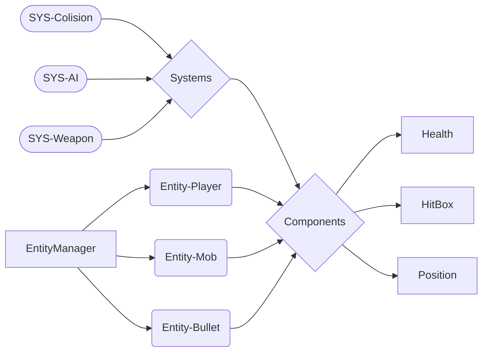
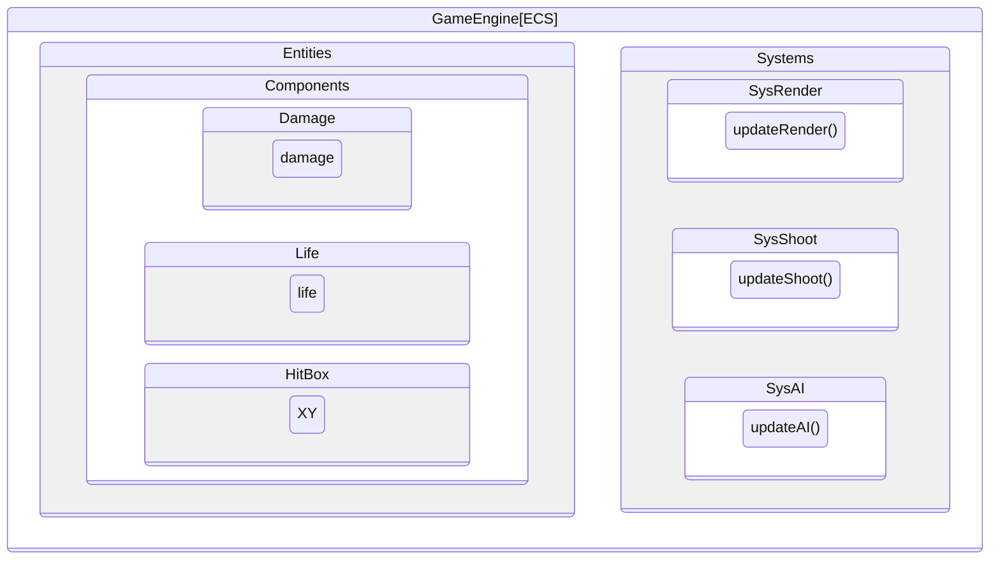

# RType_docs


<a name="Top"/>
 <h1 align="center">Table of Contents</h1>

- [Client](#client)
- [Server](#server)
- [GameEngine](#gameenegine)

<a name="Client"/>

<p align="right"><a href="#Top">back to top</a></p>

# Client

- [Introduction](#introduction)
- [User-Interface](#user-interface)
- [GameEngine-Integration](#gameengine-integration)
- [Mode](#mode)
  * [Multi-Player](#multi-player)
  * [Single-Player](#single-player)
- [Network-Protocole](#network-protocole)

### Introduction

The client component of this project is the interactive interface through which players engage with the re-created ***RType arcade game***. 
It serves as the point of access to the gaming experience and facilitates both single-player and multi-player modes. The client is meticulously 
designed and developed in C++ to provide a user-friendly, immersive, and responsive gaming environment.


### User Interface

The client offers a visually appealing and intuitive user interface that allows players to navigate the game and much more...

### GameEngine-Integration

It seamlessly integrates with the modular game engine, ensuring the efficient execution of game mechanics, graphics rendering, and audio effects.

### Mode

* ##### Multi-Player

Players can connect to the server create their lobby and join each others and participate in multiplayer matches, battling together in real-time against AI opponents. The client facilitates communication with the server for synchronized gameplay.

* ##### Single-Player

For those who prefer solo gaming you can challenge AI opponents, adding an extra layer of excitement to the gaming experience.


### Network-Protocols

The client uses a combination of network protocols for seamless gaming. It employs ***[TCP]*** for menu navigation, room creation, and other interactions, ensuring data integrity and reliability. During actual gameplay, the client switches to ***[UDP]*** for low-latency communication, delivering a responsive and immersive gaming experience.


<p align="right"><a href="#Top">back to top</a></p>

# 

<a name="Server"/>

# Server

- [Introduction](#introduction)
- [Protocole-TCP/UDP](#protocole-tcp/udp)
  * [TCP](#tcp)
  * [UDP](#udp)

- [Rooms](#rooms)

### [Protocole-TCP/UDP]

<h4 align="center">TCP</h4>


<h4 align="center">UDP</h4>

### [Rooms]

<p align="right"><a href="#Top">back to top</a></p>

# 

<a name="Game-Engine"/>

# Game-Engine [ECS]

- [[ Structure ] ](#structure)
  * [Schema-Layer/subsystem](#schema)
  * [[E]ntity](#entity)
  * [[C]omponents](#components)
  * [[S]ystems](#systems)
- [[ Usage] ](#usage)
  * [Beginner](#beginner)
  * [Advanced](#advanced)

### [ Structure ]

<a name="schema"/>
<h4 align="center">Schema Layer/subsystem</h4>





#

<a name="Entity"/>
<h4 align="center">[E]ntity</h4>


> EntityManager.hpp

```cpp

namespace GameEngine {

    class EntityManager {
        public:
            EntityManager() {}
            EntityManager(EntityManager &entityManager) {
                _listEntity = entityManager.getEntities();
            }
            ~EntityManager() {}

            std::shared_ptr<Entity>& createEntity() {
                _entityPtr = std::make_shared<Entity>(1);
                return _entityPtr;
            }

            std::shared_ptr<Entity>& addEntity(Entity entity) {
                _entityPtr = std::make_shared<Entity>(entity);
                _listEntity.push_back(_entityPtr);
                return _entityPtr;
            }

            std::shared_ptr<Entity>& getEntity(std::string uuid) {
                for (auto& entityPtr : _listEntity) {
                    if (entityPtr->getUuid() == uuid) {
                        return entityPtr;
                    }
                }
                throw std::runtime_error("Entity not found for uuid " + uuid);
            }

            std::shared_ptr<Entity>& getEntityById(unsigned int id) {
                for (auto& entityPtr : _listEntity) {
                    if (entityPtr->getId() == id) {
                        return entityPtr;
                    }
                }
                throw std::runtime_error("Entity not found");
            }

            std::shared_ptr<EntityManager> getEntityManager() {
                return std::make_shared<EntityManager>(*this);
            }

            std::list<std::shared_ptr<Entity>>& getEntities() {
                return _listEntity;
            }

            std::list<std::shared_ptr<Entity>> getEntitiesByType(int entityType) {
                std::list<std::shared_ptr<Entity>> listEntity;
                for (std::shared_ptr<Entity> &entityPtr : _listEntity) {
                    if (entityPtr.get()->getType() == entityType) {
                        listEntity.push_back(entityPtr);
                    }
                }
                return listEntity;
            }

            std::shared_ptr<Entity> getEntityByType(int entityType) {
                for (std::shared_ptr<Entity> &entityPtr : _listEntity) {
                    if (entityPtr.get()->getType() == entityType) {
                        return entityPtr;
                    }
                }
                return nullptr;
            }

            std::mutex &getMutex() {
                return _mutex;
            }

            void deleteEntity(std::string uuid) {
                std::lock_guard<std::mutex> lock(_mutex);
                for (std::shared_ptr<Entity> entityPtr : _listEntity) {
                    if (entityPtr->getUuid() == uuid) {
                        _listEntity.remove(entityPtr);
                        return;
                    }
                }
                // unlock();
            }

            bool try_lock() {
                return _mutex.try_lock();
            }

            void lock() {
                _mutex.lock();
            }

            void unlock() {
                _mutex.unlock();
            }

        private:
            std::list<std::shared_ptr<Entity>> _listEntity;
            std::shared_ptr<Entity> _entityPtr;
            std::mutex _mutex;
    };

}
```
# 

>Entity.hpp

```cpp
using namespace GameEngine;

namespace GameEngine {
    class Entity {
        public:
            Entity() : _id(84), _entityType(42) {}
            Entity(unsigned int id, int type) : _id(id), _entityType(type), _isDeath(false) {
                _Destroy.timeout_ = 0.03;
            }

            Entity(int type) : _id(0), _entityType(type), _isDeath(false) {
                _Destroy.timeout_ = 0.03;
            }

            Entity(const Entity &entity) {
                _id = entity._id;
                _entityType = entity._entityType;
                _entityContent = entity._entityContent;
                _isDeath = entity._isDeath;
                _uuid = entity._uuid;
            }

            void init() {
                _uuid = boost::uuids::to_string(boost::uuids::random_generator()());
                // std::cout << "UUID: " << _uuid << std::endl;
            }

            ~Entity() {}

            template <class Archive>
            void serialize(Archive & ar, const unsigned int version) {
                ar & _id;
                ar & _uuid;
                ar & _entityType;
                ar & _entityContent;
                ar & _isDeath;
            }

            bool canDestroy() {
                if (_Destroy.can_execute())
                    return true;
                return false;
            }

            void startDestroy() {
                _Destroy.Start();
            }

            bool DestroyStarted(){return _Destroy.isStarted();}

            unsigned int getId() const {
                return _id;
            }

            std::string getUuid() {
                return _uuid;
            }

            template <typename T>
            void addComponent(T &component) {
                _entityContent.push_back(component);
            }

            template <typename T>
            void deleteComponent(std::shared_ptr<T> component) {
                _entityContent.remove(component);
            }

            template <typename T>
            std::shared_ptr<T> getComponentByType(CONFIG::CompType type) {
                for (auto &component : _entityContent) {
                    if (component.get()->getType() == type)
                        return std::dynamic_pointer_cast<T>(component);
                }
                return nullptr;
            }

            template <typename T>
            std::vector<std::shared_ptr<T>> getComponentsByType(CONFIG::CompType type) {
                std::vector<std::shared_ptr<T>> result;
                for (auto &component : _entityContent) {
                    if (component->getType() == type) {
                        auto derivedComponent = std::dynamic_pointer_cast<T>(component);
                        if (derivedComponent) {
                            result.push_back(derivedComponent);
                        }
                    }
                }
                return result;
            }

            template <typename T>
            std::shared_ptr<T> getComponentById(int id) {
                for (auto &component : _entityContent) {
                    if (component.get()->getId() == id)
                        return component;
                }
                return nullptr;
            }

            template <typename T>
            std::shared_ptr<T> getComponentByUuid(std::string uuid) {
                for (auto &component : _entityContent) {
                    if (component.get()->getUuid() == uuid)
                        return component;
                }
                return nullptr;
            }

            std::list<std::shared_ptr<AComponent>> &getComponents() {
                return _entityContent;
            }

            void setEntityContent(std::list<std::shared_ptr<AComponent>> &entity) {
                _entityContent = entity;
            }

            void setIsDeath(bool status){_isDeath = status;}
            void setType(int type) {_entityType = type;}
            int getType() const {return _entityType;}
            int getIsDeath(){return _isDeath;}
            std::string getUuid() const {return _uuid;}

            void setId(unsigned int id) {
                _id = id;
            }

        private:
            Timeout _Destroy;
            bool _isDeath;
            std::list<std::shared_ptr<AComponent>> _entityContent;
            unsigned int _id;
            int _entityType;
            std::string _uuid;
    };
}
```

#

<a name="Components"/>
<h4 align="center">[C]omponents</h4>

> IComponent.hpp

```cpp
namespace GameEngine {

    class IComponent {
        public:
            virtual ~IComponent() = default;
            virtual CONFIG::CompType getType() = 0;
            virtual void setType(const CONFIG::CompType type) = 0;
            virtual int getId() = 0;
            virtual std::string getUuid() = 0;
            virtual void setId(const int id) = 0;
            template <typename Archive>
            void serialize(Archive& ar, const unsigned int version) {}
    };
}

```
#

> AComponent.hpp

```cpp
namespace GameEngine {

    class AComponent : public IComponent{
        public:
            AComponent() {
                _id = 0;
            };
            AComponent(CONFIG::CompType type) : _type(type) {
                _id = 0;
            };
            AComponent(AComponent &component) {
                _type = component.getType();
                _id = component.getId();
                _uuid = component.getUuid();
            };
            virtual ~AComponent() = default;
            template <class Archive>

            void serialize(Archive & ar, const unsigned int version) {
                ar.template register_type<AComponent>();
                ar & _id;
                // ar & _uuid;
                ar & _type;
            }

            virtual CONFIG::CompType getType() {return _type;};
            virtual void setType(const CONFIG::CompType type) {_type = type;};
            virtual int getId() {return _id;};
            virtual void setId(const int id) {_id = id;};
            virtual std::string getUuid() {return _uuid;};

        protected:
            int _id;
            CONFIG::CompType _type;
            std::string _uuid;
    };
}

```

# 

<a name="Systems"/>
<h4 align="center">[S]ystems</h4>

> ISystem.hpp

```cpp


namespace GameEngine {

    class ISystem {
        public:
            virtual ~ISystem() = default;
            virtual void update() = 0;
    };
}
```

#

> ASystem.hpp

```cpp
namespace GameEngine {

    class ASystem : public ISystem {
        public:
            ASystem(std::shared_ptr<EntityManager> &entityManagerPtr) : _entityRefList(entityManagerPtr){}
            virtual ~ASystem() = default;

            virtual void update() {};

        protected:
           std::shared_ptr<EntityManager> &_entityRefList;

        private:
    };
}
```

<p align="right"><a href="#Top">back to top</a></p>

### [ Usage ]

<a name="Beginner"/>
<h4 align="center">Beginner</h4>

* Create new ***map*** for RType

	 This is a good example of a modification to help you understand the code as a whole.
	 The procedure for creating a new map is available in a dedicated [CONFIG_MAP.md](https://github.com/EpitechPromo2026/B-CPP-500-MAR-5-1-rtype-maori.dino/blob/main/assets/maps/CONFIG_MAP.md) 

<a name="Advanced"/>
<h4 align="center">Advanced</h4>

* Create Component

	*  Info : The components in an ECS (Entity-Component-System) architecture of a C++ game engine are autonomous, reusable entities that encapsulate the specific behaviour and data of a game object, enabling modular and efficient management of the game's functionalities.

	*  Instruction : To create new components you need to add yourComponent.hpp in [/GameEngine/Components/yourComponent.hpp](https://github.com/EpitechPromo2026/B-CPP-500-MAR-5-1-rtype-maori.dino/tree/main/GameEngine/Components) . The synthax of an abstract component must of course be respected, see example. The name of your component must also be implemented in the [/GameEngine/Utils/Config.hpp](https://github.com/EpitechPromo2026/B-CPP-500-MAR-5-1-rtype-maori.dino/blob/main/GameEngine/Utils/Utils.hpp) file in the list of component types named ***CompType***.

> yourComponent.hpp
```cpp
#include  "../../Components/AComponent/AComponent.hpp"

namespace GameEngine {

	class yourComponent : public AComponent  {
	
		public:
			friend class boost::serialization::access;
			friend class AComponent;

			yourComponent() : AComponent(CONFIG::CompType::yourComponent) {}
			yourComponent(CONFIG::CompType  type,  int id, "component parameters ...")  :  AComponent(CONFIG::CompType::POSITION), _idComponent(id), _type(type), int id, "component parameters ..." {}

			virtual  ~yourComponent()  =  default;

			template<class  Archive>
			void  serialize(Archive  &  ar,  const  unsigned  int  version)  {
				ar.template  register_type<Position>();
				ar &  boost::serialization::base_object<AComponent>(*this);

				ar & _idComponent;
				ar & _type;
				ar & _xPos;
				ar & _yPos;
			}
			
		// Setter and getter function for your components value can be implement here

			virtual CONFIG::CompType getType() {return _type;};
			virtual void setType(const CONFIG::CompType type) {_type = type;};
			virtual int getId() {return _idComponent;};
			virtual void setId(const int id) {_idComponent = id;};

		protected:
			int _idComponent;
			CONFIG::CompType _type;

		private:
			// your components value
	};
}

BOOST_CLASS_EXPORT_KEY(GameEngine::yourComponent);
```

</br>

* Create System
	* Info : The systems in the ECS architecture of a C++ game engine are independent processing modules that define the overall behaviour of the game by interacting with the entity components, allowing the game logic to be organised and controlled in a separate and extensible way.
	
	*  Instruction : To create new system you need to add yourSys.hpp in [/GameEngine/Systems/yourSystem.hpp](https://github.com/EpitechPromo2026/B-CPP-500-MAR-5-1-rtype-maori.dino/tree/main/GameEngine/Systems) . The synthax of an abstract systems must of course be respected, see example. Your systems will have access to the [EntityManager](#Entity), which allows you to manipulate entities. It will be useful for applying your systems to the entities you want.
	
> yourSystem.hpp
```cpp
#include  "../ASystem/ASystem.hpp"
// Include Components needed here
#include  "../../Components/Position/Position.hpp"
#include  "../../Utils/Timeout.hpp"
#include  <chrono>
#include  <random>

namespace GameEngine {

	class yourSys : public ISystem {

	yourSys(std::list<std::shared_ptr<Entity>>  &entityList)  :  _entities(entityList),  isRunning(true)  {}
	~yourSys()  {};

	virtual  void  update()  override  {
		for  (std::shared_ptr<Entity>  &entityPtr  :  _entities)  {
				// check or manipulate entities by type or by components type in entities
		}
	};

	private:
		bool  isRunning;
		std::list<std::shared_ptr<Entity>>  _entities;

	};

}	
```

<p align="right"><a href="#Top">back to top</a></p>
