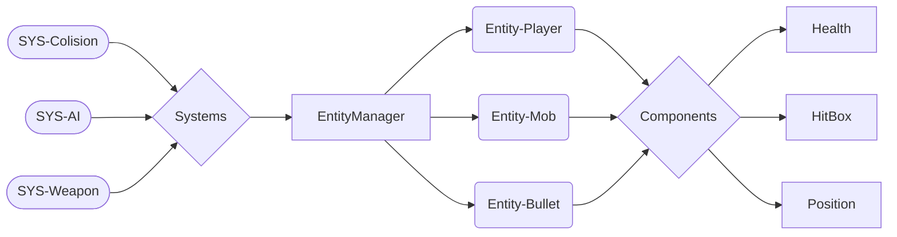

# RType_docs


<a name="Top"/>
 <h1 align="center">Table of Contents</h1>

<div align="center">

 [Client](#Client)  
 [Server](#Server)  
 [Game-Engine](#Game-Engine)

</div>

# 

<a name="Client"/>

<p align="right"><a href="#Top">back to top</a></p>

# Client

- [Introduction](#introduction)
- [User-Interface](#user-interface)
- [GameEngine-Integration](#gameengine-integration)
- [Mode](#mode)
  * [Multi-Player](#multi-player)
  * [Single-Player](#single-player)
- [Network-Protocole](#network-protocole)

### Introduction

    The client component of this project is the interactive interface through which players engage with the re-created RType arcade game. It serves as the point of access to the gaming experience and facilitates both single-player and multi-player modes. The client is meticulously designed and developed in C++ to provide a user-friendly, immersive, and responsive gaming environment.

### User Interface

    The client offers a visually appealing and intuitive user interface that allows players to navigate the game and much more...

### Game Engine Integration

    It seamlessly integrates with the modular game engine, ensuring the efficient execution of game mechanics, graphics rendering, and audio effects.

### Mode

* ##### Multi-Player

    Players can connect to the server create their lobby and join each others and participate in multiplayer matches, battling together in real-time against AI opponents. The client facilitates communication with the server for synchronized gameplay.

* ##### Single-Player

   For those who prefer solo gaming you can challenge AI opponents, adding an extra layer of excitement to the gaming experience.


### Network Protocols

   The client uses a combination of network protocols for seamless gaming. It employs ***[TCP]*** for menu navigation, room creation, and other interactions, ensuring data integrity and reliability. During actual gameplay, the client switches to ***[UDP]*** for low-latency communication, delivering a responsive and immersive gaming experience.


<p align="right"><a href="#Top">back to top</a></p>

# 

<a name="Server"/>

# Server

- [Introduction](#introduction)
- [Protocole-TCP/UDP](#protocole-tcp/udp)
  * [TCP](#tcp)
  * [UDP](#udp)

- [Rooms](#rooms)

### [Protocole-TCP/UDP]

<h4 align="center">TCP</h4>


<h4 align="center">UDP</h4>

### [Rooms]

<p align="right"><a href="#Top">back to top</a></p>

# 

<a name="Game-Engine"/>

# Game-Engine [ECS]

- [[ Structure ] ](#structure)
  * [Schema-Layer/subsystem](#schema)
  * [[E]ntity](#entity)
  * [[C]omponents](#components)
  * [[S]ystems](#systems)
- [[ Usage] ](#usage)
  * [Beginner](#beginner)
  * [Advanced](#advanced)

### [ Structure ]

<a name="schema"/>
<h4 align="center">Schema Layer/subsystem</h4>



``` mermaid
stateDiagram-v2
    state GameEngine[ECS] {
            state Entities {
                direction LR
                state Components {
                    direction LR
                    state Damage {
                        direction LR
                        int damage
                    }
                    state Life {
                        direction LR
                        int life
                   }
                   state HitBox {
                        direction LR
                        int x
			int y
                   }
               }

            }
            state Systems {
                direction LR
                state SysRender {
                    direction LR
                    update()
                }
                state SysShoot {
                    direction LR
                    update()
                }
                state SysAI {
                    direction LR
                    update()
                }
            }
    }
```

#

<a name="Entity"/>
<h4 align="center">[E]ntity</h4>


> EntityManager.hpp

```cpp

namespace GameEngine {

    class EntityManager {
        public:
            EntityManager() {}
            ~EntityManager() {}

            std::shared_ptr<Entity>& createEntity();
            std::shared_ptr<Entity>& addEntity(Entity entity);
            std::shared_ptr<Entity>& getEntity(unsigned int id);
            void deleteEntity(unsigned int id);

            std::list<std::shared_ptr<Entity>>& getEntities();
            std::list<std::shared_ptr<Entity>> getEntitiesByType(int entityType);


        private:
            std::list<std::shared_ptr<Entity>> _listEntity;
            std::shared_ptr<Entity> _entityPtr;
    };

}
```
# 

>Entity.hpp

```cpp
namespace GameEngine {
    class Entity {
        public:
            Entity(unsigned int id, int type) : _id(id), _entityType(type) {}
            Entity(unsigned int id) : _id(id), _entityType(0) {}

            ~Entity() {}

            unsigned int getId() const;
            template <typename T>
            void addComponent(T &component);

            template <typename T>
            void deleteComponent(std::shared_ptr<T> component);

            template <typename T>
            std::shared_ptr<T> getComponentByType(CONFIG::CompType type);

            template <typename T>
            std::shared_ptr<T> getComponentById(int id);

            template <typename T>
            std::list<std::shared_ptr<T>> &getComponents();

            int getType() const;

        private:
            std::list<std::shared_ptr<IComponent>> _entityContent;
            unsigned int _id;
            int _entityType;

    };
}
```

#

<a name="Components"/>
<h4 align="center">[C]omponents</h4>

> IComponent.hpp

```cpp
namespace GameEngine {

    class IComponent {
        public:
            virtual ~IComponent() = default;

            virtual CONFIG::CompType getType() = 0;
            virtual void setType(const CONFIG::CompType type) = 0;
            virtual int getId() = 0;
            virtual void setId(const int id) = 0;
    };
}

```
#

> AComponent.hpp

```cpp
namespace GameEngine {

    class AComponent : public IComponent{
        public:
            AComponent(CONFIG::CompType type) : _type(type) {};
            AComponent(AComponent &component) {
                _type = component.getType();
                _id = component.getId();
            };
            ~AComponent() = default;

            virtual CONFIG::CompType getType() {return _type;};
            virtual void setType(const CONFIG::CompType type) {_type = type;};
            virtual int getId() {return _id;};
            virtual void setId(const int id) {_id = id;};

        protected:
            int _id;
            CONFIG::CompType _type;
    };
}
```

# 

<a name="Systems"/>
<h4 align="center">[S]ystems</h4>

> ISystem.hpp

```cpp


namespace GameEngine {

    class ISystem {
        public:
            virtual ~ISystem() = default;
            virtual void update() = 0;
    };
}
```

#

> ASystem.hpp

```cpp
namespace GameEngine {

    class ASystem : public ISystem {
        public:
            ASystem(std::shared_ptr<EntityManager> &entityManagerPtr) : _entityRefList(entityManagerPtr){}
            virtual ~ASystem() = default;

            virtual void update() {};

        protected:
           std::shared_ptr<EntityManager> &_entityRefList;

        private:
    };
}
```

<p align="right"><a href="#Top">back to top</a></p>

### [ Usage ]

<a name="Beginner"/>
<h4 align="center">Beginner</h4>

* Create new ***map*** for RType

	 This is a good example of a modification to help you understand the code as a whole.
	 The procedure for creating a new map is available in a dedicated [CONFIG_MAP.md](https://github.com/EpitechPromo2026/B-CPP-500-MAR-5-1-rtype-maori.dino/blob/main/assets/maps/CONFIG_MAP.md) 

<a name="Advanced"/>
<h4 align="center">Advanced</h4>

* Create Component

	*  Info : The components in an ECS (Entity-Component-System) architecture of a C++ game engine are autonomous, reusable entities that encapsulate the specific behaviour and data of a game object, enabling modular and efficient management of the game's functionalities.

	*  Instruction : To create new components you need to add yourComponent.hpp in [/GameEngine/Components/yourComponent.hpp](https://github.com/EpitechPromo2026/B-CPP-500-MAR-5-1-rtype-maori.dino/tree/main/GameEngine/Components) . The synthax of an abstract component must of course be respected, see example. The name of your component must also be implemented in the [/GameEngine/Utils/Config.hpp](https://github.com/EpitechPromo2026/B-CPP-500-MAR-5-1-rtype-maori.dino/blob/main/GameEngine/Utils/Utils.hpp) file in the list of component types named ***CompType***.

> yourComponent.hpp
```cpp
#include  "../../Components/AComponent/AComponent.hpp"

namespace GameEngine {

	class yourComponent : public AComponent  {
	
		public:
			friend class boost::serialization::access;
			friend class AComponent;

			yourComponent() : AComponent(CONFIG::CompType::yourComponent) {}
			yourComponent(CONFIG::CompType  type,  int id, "component parameters ...")  :  AComponent(CONFIG::CompType::POSITION), _idComponent(id), _type(type), int id, "component parameters ..." {}

			virtual  ~yourComponent()  =  default;

			template<class  Archive>
			void  serialize(Archive  &  ar,  const  unsigned  int  version)  {
				ar.template  register_type<Position>();
				ar &  boost::serialization::base_object<AComponent>(*this);

				ar & _idComponent;
				ar & _type;
				ar & _xPos;
				ar & _yPos;
			}
			
		// Setter and getter function for your components value can be implement here

			virtual CONFIG::CompType getType() {return _type;};
			virtual void setType(const CONFIG::CompType type) {_type = type;};
			virtual int getId() {return _idComponent;};
			virtual void setId(const int id) {_idComponent = id;};

		protected:
			int _idComponent;
			CONFIG::CompType _type;

		private:
			// your components value
	};
}

BOOST_CLASS_EXPORT_KEY(GameEngine::yourComponent);
```

</br>

* Create System
	* Info : The systems in the ECS architecture of a C++ game engine are independent processing modules that define the overall behaviour of the game by interacting with the entity components, allowing the game logic to be organised and controlled in a separate and extensible way.
	
	*  Instruction : To create new system you need to add yourSys.hpp in [/GameEngine/Systems/yourSystem.hpp](https://github.com/EpitechPromo2026/B-CPP-500-MAR-5-1-rtype-maori.dino/tree/main/GameEngine/Systems) . The synthax of an abstract systems must of course be respected, see example. Your systems will have access to the [EntityManager](#Entity), which allows you to manipulate entities. It will be useful for applying your systems to the entities you want.
	
> yourSystem.hpp
```cpp
#include  "../ASystem/ASystem.hpp"
// Include Components needed here
#include  "../../Components/Position/Position.hpp"
#include  "../../Utils/Timeout.hpp"
#include  <chrono>
#include  <random>

namespace GameEngine {

	class yourSys : public ISystem {

	yourSys(std::list<std::shared_ptr<Entity>>  &entityList)  :  _entities(entityList),  isRunning(true)  {}
	~yourSys()  {};

	virtual  void  update()  override  {
		for  (std::shared_ptr<Entity>  &entityPtr  :  _entities)  {
				// check or manipulate entities by type or by components type in entities
		}
	};

	private:
		bool  isRunning;
		std::list<std::shared_ptr<Entity>>  _entities;

	};

}	
```

<p align="right"><a href="#Top">back to top</a></p>
